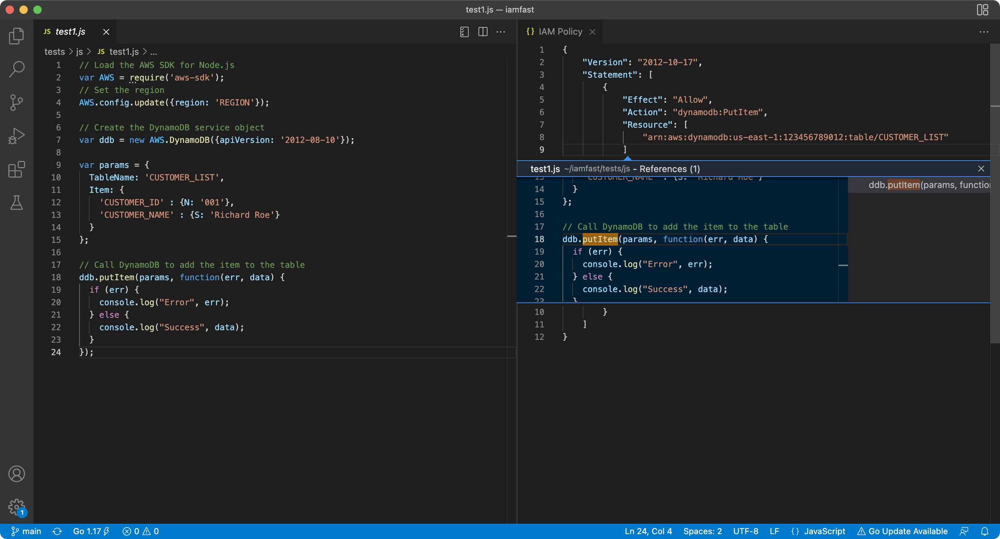

<p align="center"><a href="https://github.com/iann0036/iamfast-js">JavaScript</a> • <a href="https://github.com/iann0036/iamfast-python">Python</a> • <a href="https://github.com/iann0036/iamfast-go">Go</a> • <a href="https://github.com/iann0036/iamfast-java">Java</a> • <b>VS Code</b></p>

# iamfast (Visual Studio Code Extension)

:construction: EXPERIMENTAL - WORK IN PROGRESS :construction:

> IAM policy generation from application code



## Updating

```
npm i -U iamfast
cd node_modules/iamfast/
mv package-module.json package.json
npm i esbuild
npm run-script prepare
```
